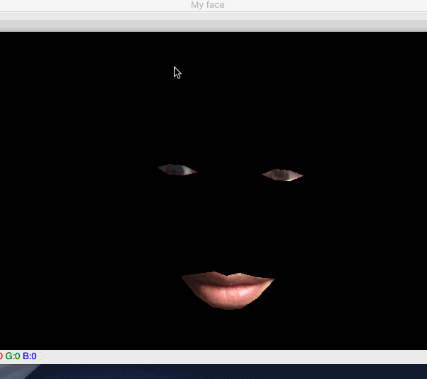

# FaceFilter

## Using python 3.7, OpenCV, Dlib, Imutils.To run this code, pls install those dependencies and download the pretrained model from [here](https://github.com/davisking/dlib-models)(We use the 68 landmarks one)

